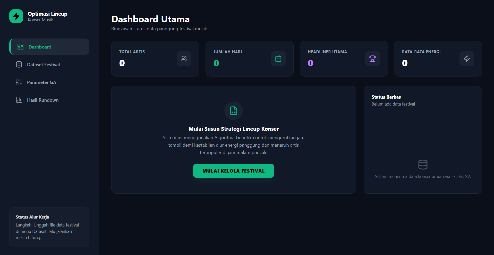
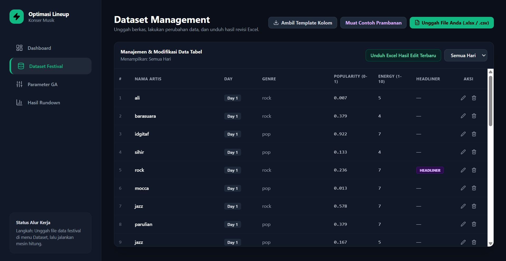
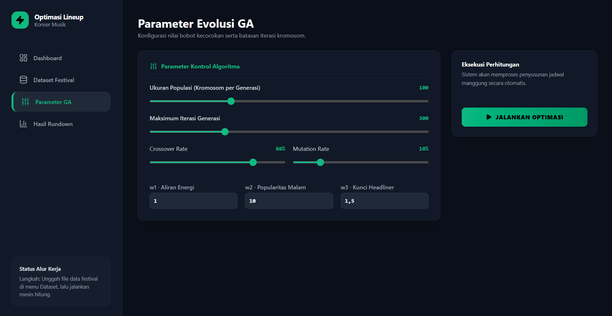
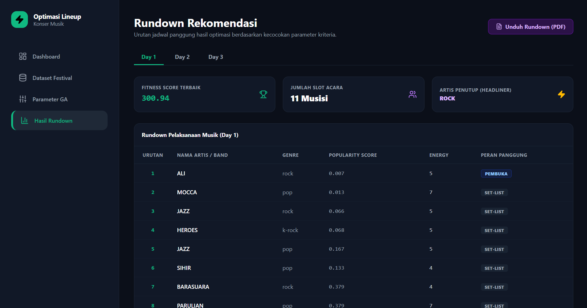
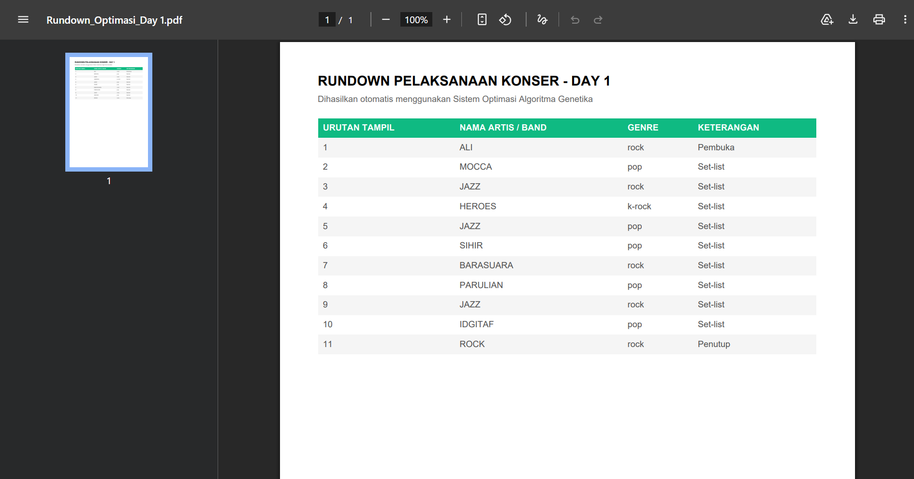

# Dashboard Optimasi Lineup Konser Musik

Aplikasi web berbasis Algoritma Genetika untuk mengoptimalkan urutan penampilan artis pada konser atau festival musik berdasarkan energy flow, popularitas artis, dan penempatan headliner.

## Screenshots

### Dashboard


### Upload Dataset


### Pengaturan Parameter Algoritma


### Hasil Optimasi


### PDF Rundown


## Tech Stack

### Frontend
- React.js
- JavaScript (ES6+)
- Tailwind CSS
- Axios
- Recharts
- Lucide React

### Backend
- Python
- FastAPI
- Pydantic
- Uvicorn

### Data Processing & Export
- Pandas
- NumPy
- SheetJS (XLSX)
- jsPDF
- jspdf-autotable

## Features

- Upload dataset festival dalam format CSV dan Excel
- Memuat dataset contoh untuk simulasi dan pengujian
- Mengelola dataset artis melalui dashboard
- Mengedit data artis secara langsung
- Menghapus data artis dari dataset
- Memfilter data berdasarkan hari festival
- Mengunduh dataset hasil perubahan ke format Excel
- Menampilkan statistik festival secara real-time
- Menampilkan total artis, jumlah hari festival, jumlah headliner, dan rata-rata energy
- Mengatur ukuran populasi (Population Size)
- Mengatur jumlah generasi maksimum (Maximum Generations)
- Mengatur nilai Crossover Rate
- Mengatur nilai Mutation Rate
- Mengatur bobot Energy Flow
- Mengatur bobot Popularitas Artis
- Mengatur bobot Penempatan Headliner
- Menjalankan optimasi lineup konser menggunakan Algoritma Genetika
- Mengoptimalkan urutan penampilan artis berdasarkan Energy Flow
- Mengoptimalkan distribusi popularitas artis dalam rundown konser
- Mengoptimalkan penempatan headliner pada slot penutup acara
- Mendukung optimasi untuk beberapa hari festival
- Menampilkan Fitness Score hasil optimasi
- Menampilkan lineup konser hasil rekomendasi sistem
- Menampilkan informasi headliner hasil optimasi
- Menampilkan grafik aliran energi (Energy Flow Analysis)
- Menampilkan grafik distribusi popularitas artis
- Menampilkan hasil optimasi berdasarkan hari festival
- Menghasilkan rundown konser secara otomatis
- Mengunduh hasil rundown konser dalam format PDF

## Algorithm

- Genetic Algorithm
- Tournament Selection
- Order Crossover (OX)
- Swap Mutation
- Elitism
- Generational Replacement

## Installation

### Clone Repository

```bash
git clone https://github.com/username/project-name.git
cd project-name
```

### Backend Setup

```bash
cd backend

pip install -r requirements.txt

uvicorn main:app --reload
```

Backend akan berjalan pada:

```text
http://localhost:8000
```

### Frontend Setup

```bash
cd frontend

npm install

npm run dev
```

Frontend akan berjalan pada:

```text
http://localhost:5173
```

## Workflow

1. Upload dataset festival atau gunakan dataset contoh.
2. Kelola dan sesuaikan data artis sesuai kebutuhan.
3. Atur parameter Algoritma Genetika.
4. Jalankan proses optimasi.
5. Analisis hasil optimasi melalui tabel dan grafik.
6. Unduh rundown konser dalam format PDF.

## Author

Developed as a full-stack web application for concert lineup optimization using Genetic Algorithm.
